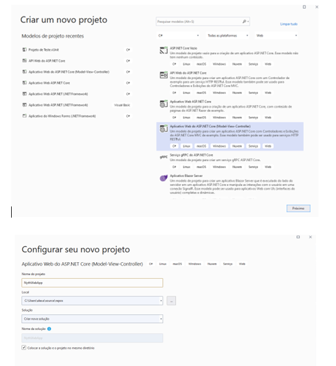
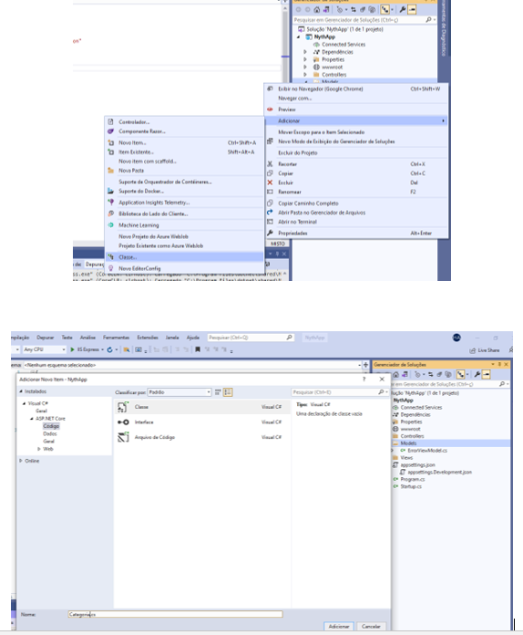
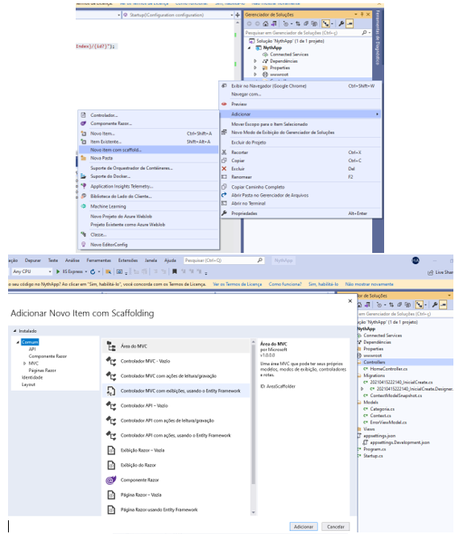
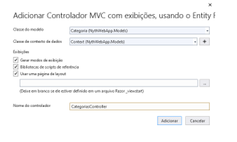
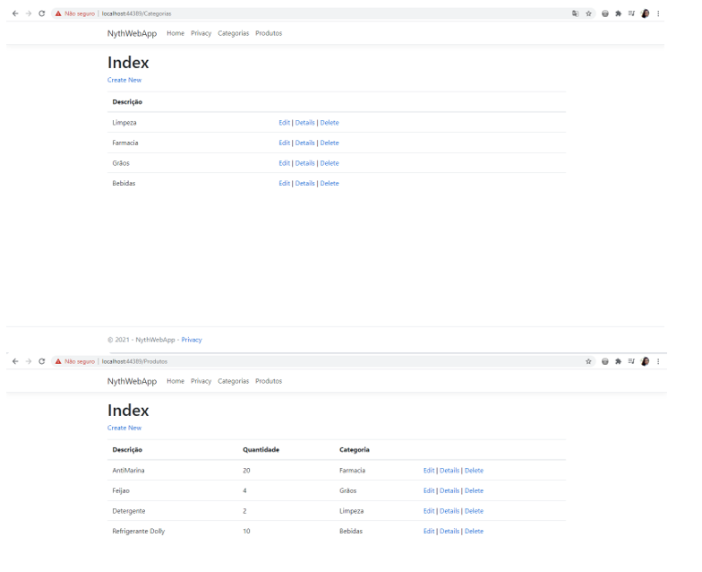

# NythWebApp 

<h2>APLICATIVO CADASTRO DE PRODUTOS POR CATEGORIA ASP.NET API UTILIZANDO ENTITY FRAMEWORK </h2>

O Entity FrameWork é um ORM (Mapeador Relacional de Objeto) que permite que os desenvolvedores .NET trabalhem com um banco de dados usando objetos .NET, neste projeto foi utilizado o banco de dados SQL. O Entity Framework permite que os desenvolvedores trabalhem com dados na forma de objetos e propriedades específicos de domínio, como clientes e endereços de clientes, sem ter que se preocupar com as tabelas e colunas de banco de dados subjacentes em que esses data são armazenados.
Este projeto foi feito através do Visual Studio 2019 com o uso do ASP .NET MVC que é um padrão de projeto que propõe a criação de 3 camadas (Model, View e Controller) onde cada uma delas executa o que é definido e pode ser visualizado através da Web, desktop e mobile. Traz como benefício isolamento das regras do negócio da interface do usuário, o que permite que exista várias interfaces de usuários que podem ser modificadas sem afetar a regra do negócio. 
Foi criado um cadastro de Categoria e Produtos. O primeiro passo foi a inclusão da Categoria e logo depois os Produtos. Também foi criado uma API (Interface de programação de Aplicação) para realizar integração desse aplicativo. 
Foram utilizados alguns recursos como:  
<ul>
<li>	Migration, onde oferece uma maneira de atualizar de forma incremental o esquema de Banco de dados que mantém em sincronia o modelo de classes do projeto preservando os dados existentes; </li>
<li> Midlewares, que são componentes de classe que é executado em todas as solicitações na aplicação e define a ordem que são executados; </li>
<li>	Data Annotations, que permite que adicione atributos e métodos em classes pra convenções padrões, Ex.: Required, Display, Range.</li>
<li>	Scaffold, é uma técnica de geração de códigos baseado em gabaritos de operações comuns que costumam ser usadas em aplicações diferentes. </li>
<li>	Swagger, que é uma linguagem de descrição de interface para descrever APIs RESTful expressas usando JSON. </li>
</ul>

<h2>PASSO A PASSO DO PROJETO</h2>
•	Abrir o Visual Studio 2019 e clicar em novo projeto Aplicativo Web do ASP.NET Core (Model-View-Controller) Colocar o nome do Projeto e a versão Atual.

•	Adicionar a Classe Categoria.

•	Ir em Console Gerenciador de Pacotes e instalar os pacotes no projeto para que o mesmo posso acessar o banco de dados:
<ol>
<li> install-Package Microsoft.EntityFrameworkCore </li>
<li> Install-Package Microsoft.EntityFrameworkCore.SqlServer</li>
<li> Install-Package Microsoft.EntityFrameworkCore.Tools </li>
</ol>

•	Criar a classe CONTEXT que é a classe que herda de uma interface do dbContext. Método responsável por configurar o Entity Framework. Na Startup.cs (ponto inicial do projeto) é preciso configurar o Services. Acrescentar o:  
- services.AddDbContext<Context>();</li>

•	No Console Gerenciador de Pacotes realizar o Migration para o funcionamento do banco de dados e após gerar um Update para criar o banco de dados.
<ol>
<li> Add-Migration InicialCreate </li>
<li> Update-Database</li>
OBS.: Para acrescentar a tabela Produto utilizar o comando:
<li> Add-Migration TabelaProduto </li>
<ol>

•	Na pasta Controller através do Scaffold adicionar um novo item utilizando controlador MVC com exibições usando o Entity FrameWork. Criar o arquivo Categorias como classe de modelo e conectar a classe Context. O mesmo passo a passo é realizado para a Controller Produtos.  
 

•	Em Views na pasta Shared, acessar o arquivo _Layout.cshtml, alterar o layout da página através do código html e acrescentado duas listas: Categorias e Produtos como links de acesso.

Após esses passos, criar a Classe Produto e atualizar no Context o DbSet Produto. O app já é capaz de salvar categorias e produtos. Alguns campos foram utilizados o Required para que o mesmo não consiga ser salvo em branco.

